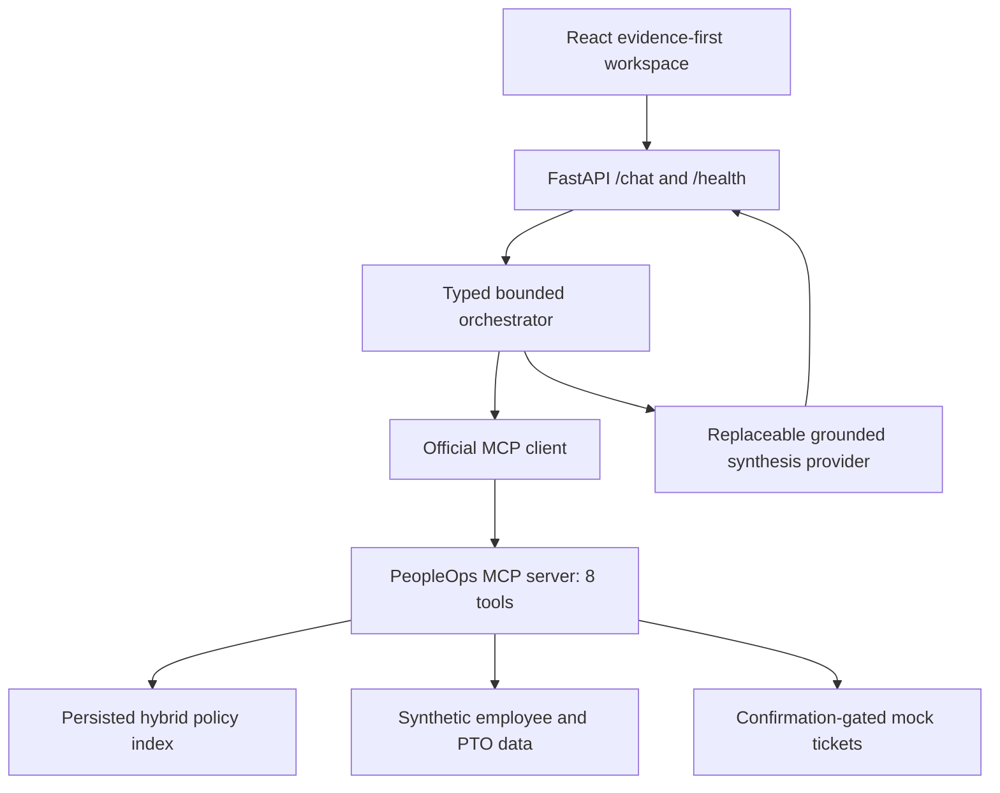

# Design and evaluation

## Design decisions

- **Deployment:** one container with logically separated modules to reduce free-tier operational risk.
- **API:** FastAPI for typed schemas, health checks, and asynchronous integration points.
- **Web:** React and Vite compiled to static assets served by FastAPI in production.
- **MCP:** eight implemented tools discovered and invoked through a dedicated client/server boundary.
- **Corpus:** 12 coherent synthetic policies with 10 Markdown and 2 PDF authoritative runtime sources.
- **Structured data:** deterministic synthetic records; no real personal information.
- **Safety:** bounded tool calls, evidence sufficiency, citation allow-listing, explicit confirmation for persistent mock actions, and controlled degraded-mode responses.
- **Testing:** deterministic substitutes in CI; live providers are not required for ordinary pull requests.
- **LLM provider:** replaceable OpenAI-compatible post-workflow synthesis; the model cannot select
  tools, change decisions, create citations, or authorize actions.

## Architecture and boundaries



The browser never accesses policies, structured records, tools, or provider credentials directly.
The orchestrator owns intent routing and state transitions, but all PeopleOps capabilities cross the
official MCP client/server boundary. The server owns authoritative retrieval, deterministic mock
data, compliance calculations, draft-only communication, and the one write-like demonstration tool.
The LLM receives only a completed, verified workflow result and an allow-list of citations; failed
provider validation returns the unchanged deterministic result.

The eight discoverable tools cover employee lookup, exact policy sections, policy search, PTO,
benefits, compliance, draft email, and confirmation-gated mock ticket creation. Remote-work and PTO
are the primary multi-step workflows; expense and ticket flows extend coverage. Every call records
tool, sanitized arguments, duration, status, and a bounded summary. Confirmation proof is signed,
expiring, bound to the exact preview, redacted from traces, and idempotent on repeat.

## RAG and data design

The authoritative synthetic corpus contains 12 policies, 45 rendered pages, and 169 indexed
sections. Ten Markdown sources and two PDF sources are ingested directly with stable policy and
section identifiers. Retrieval combines deterministic feature-hash dense similarity, BM25-style
lexical scoring, bounded query decomposition, and hybrid ranking at `k=8`. Evidence-sufficiency,
conflict, and citation allow-list gates run before an answer is returned. Structured records cover
30 fictional employees and contain no real personal information.

## Evaluation design

The project uses 25 pre-implementation gold cases:

| Category | Cases |
|---|---:|
| Straightforward policy questions | 7 |
| Multi-document policy questions | 5 |
| Employee-specific and tool workflows | 6 |
| Ambiguous requests requiring clarification | 4 |
| Out-of-scope, escalation, and safety | 3 |

Each case identifies expected facts, policy sections, required, forbidden, and post-confirmation tools, expected workflow outcome, answer constraints, and action-safety behavior. The fixed synthetic as-of date is **2026-09-01**, matching the policy corpus effective date. `evaluation/gold_cases.json` is validated against Pydantic contracts, corpus section headings, MCP tool names, and the required category distribution.

## Metrics

- groundedness of material claims;
- expected-fact and answer-constraint accuracy;
- claim-to-policy/tool support;
- citation accuracy and retrieval evidence recall;
- tool-selection accuracy;
- workflow completion;
- clarification and escalation accuracy;
- action-safety pass rate;
- warm latency p50 and p95;
- cold-start latency reported separately.

The Phase 5/10 retrieval ablation compares dense-only retrieval at `k=5`, hybrid retrieval at `k=5`,
and hybrid retrieval at `k=8`. Across the 24 cases with policy evidence and 48 exact expected
sections, the measured recalls were 83.33%, 95.83%, and 100.00%, respectively. Hybrid `k=8` is the
selected configuration.

The complete Phase 10 run executes all 25 cases through the real orchestrator and MCP boundary. It
records 100% expected-fact accuracy, answer-constraint adherence, claim support, groundedness,
citation accuracy and coverage, retrieval evidence recall, tool-selection accuracy, workflow
completion, clarification/escalation accuracy, action safety, and primary-demo completion. Both
primary workflows completed ten consecutive warm runs with repeatable verified results. Local
deterministic-provider latency was 683 ms for the first-process primary request and 132 ms p50 /
204 ms p95 across 20 warm cases. See `docs/phase10-evaluation-submission.md` for definitions and
case-level evidence.

The Phase 6 machine-readable tool validation discovered all eight tools, found input and output
schemas for all eight, completed one traced call per tool, rejected an unsigned ticket action,
returned the same mock ticket for an idempotent repeat, omitted the confirmation token from traces,
and verified the committed ticket seed was unchanged. These are tool-layer results, not full
workflow-selection metrics.

The Phase 7 focused workflow evaluation repeats the remote-work and PTO primary workflows three
times each, exercises the expense backup, and records exact citations and bounded tool paths. It
also proves no-tool clarification for missing identity and ambiguous dates, fail-closed unavailable
service behavior, policy-conflict escalation, preview-before-create confirmation, idempotency,
token redaction, and unchanged fixtures.

The Phase 8 interface suite verifies the grader-visible evidence path: live health, preset loading,
employee selection and context, cited results, complete operational trace, request and trace IDs,
explicit confirmation, request-bound creation, token non-rendering, and cancel-without-create.

The provider suite verifies OpenRouter request/authentication shape, one bounded transient retry,
authenticated cached model health, credential redaction, structured JSON parsing, exact citation
coverage, protected facts, unknown fact rejection, provider-mode orchestration, and deterministic
fallback. CI exercises this boundary without network access; production evidence requires the
owner-configured secret and provider-aware hosted smoke.

A separate 15-case intent suite covers paraphrases, typographical errors, country/date aliases,
mixed intent, adversarial confirmation bypass, and unsupported scope; all 15 cases pass. An isolated
dense-retrieval comparison on the same chunks shows `all-MiniLM-L6-v2` improves direct dense `k=5`
recall from 37.50% to 56.25%, but the production hybrid `k=8` path remains selected at 100% evidence
recall and lower deployment cost. Three generic read-only production observations preserve 100%
workflow, citation, tool, and no-write integrity; one accepted provider output and two safe fallbacks
produce a 33.33% provider-acceptance observation, not an SLA.

## Current evidence

Phases 1 through 8 validate startup and health reporting; the 12-policy/45-page corpus; deterministic
structured data; API and evaluation contracts; live MCP discovery and calls; the bounded deployed
workflow; direct Markdown and PDF ingestion; a persisted 169-section hybrid index; evidence
sufficiency and conflict behavior; citation allow-listing; and 100% retrieval evidence recall for
the selected Phase 5 configuration. Phase 6 additionally proves eight schema-valid tools, shared
timeouts and sanitized traces, read-only structured-data operations, deterministic compliance,
draft-only email behavior, confirmation-gated idempotent mock actions, and typed remote-work, PTO,
expense, and ticket workflows with clarification, retry, evidence, conflict, citation, escalation,
and confirmation gates. Phase 8 adds the responsive evidence-first product workspace and interactive
confirmation experience. The provider integration adds bounded grounded synthesis and safe fallback.
Phase 10 completes the automated gold-suite evaluation and submission evidence. The former
missing-ID mismatch was corrected in the gold contract: because the prompt omits the affected
employee and minimum-necessary summary, clarification is the correct expected outcome and the
create tool is forbidden. A separate fully specified case proves preview, confirmation, MCP
creation, redaction, and idempotency. The human-recorded presentation and final video-link check
remain owner-controlled submission steps and are intentionally outside this app-only assessment.

## Reproduction

From the repository root after `python -m pip install -e ".[dev]"`:

```powershell
python scripts/export_contract_schemas.py --check
python scripts/validate_phase3_assets.py
python scripts/build_rag_index.py --check
python scripts/evaluate_mcp_tools.py
python scripts/evaluate_workflows.py
python scripts/evaluate_intents.py --write
python scripts/evaluate_gold.py --write
python scripts/evaluate_embeddings.py --check
python scripts/evaluate_hosted_provider.py --check
python -m pytest --cov=app --cov=peopleops_mcp --cov-fail-under=85
```

The neural comparison is intentionally optional in routine CI; regenerate it with
`python -m pip install -e ".[neural-eval]"` followed by
`python scripts/evaluate_embeddings.py --write`. Hosted-provider regeneration is read-only and
requires explicit production access; routine CI validates the committed evidence without sending
network requests.

## Limitations

The policies and employee records are synthetic. The local embedding model is corpus-specific, the
confirmation store and mock tickets are process-local, and the free hosted provider can be slow or
unavailable. The deterministic workflow remains authoritative when synthesis falls back. The system
is a demonstration assistant, not a system of record or a replacement for People/Legal review.
