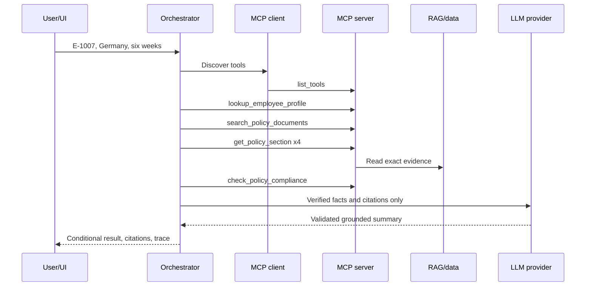
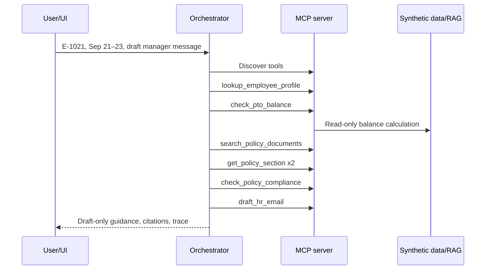

# 7–10 minute demonstration rehearsal

Target length: **8 minutes 30 seconds**. Use the deployed application and keep the citations and
tool-trace panels visible whenever explaining evidence.

## Preflight

1. Open the application, `/health`, repository Actions page, and this script in separate tabs.
2. Wake the free Render service before recording and confirm `/health` reports the expected release
   SHA, ready MCP/RAG/mock-data components, and a ready OpenRouter provider.
3. Select employee `E-1007`, clear chat, and set browser zoom so citations and trace text are legible.
4. Keep the repository free of keys, real employee data, and local `.env` files.

## Timed script

| Time | Screen/action | Narration objective |
|---:|---|---|
| 0:00–0:40 | Title and synthetic-data banner | State the problem, fictional company, and no-real-data boundary. |
| 0:40–1:20 | Architecture diagram | Explain UI → API/orchestrator → official MCP client/server → RAG/data → grounded LLM synthesis. |
| 1:20–3:20 | Run International remote work for E-1007 | Show conditional result, four citations, eight traced MCP operations, arguments/results, request ID, trace ID, and provider metadata. |
| 3:20–4:55 | Run PTO request guidance for E-1021 | Show profile and balance lookup, exact PTO sections, deterministic compliance, draft-only email, and unchanged balance. |
| 4:55–5:35 | Ask “Can I take next week off?” | Show no-tool clarification and explain why dates and identity are not inferred. |
| 5:35–6:35 | Run mock HR ticket for E-1011 | Show sanitized preview, absence of create call, explicit confirmation, returned mock ID, and in-memory-only notice. |
| 6:35–7:20 | `/health`, CI, deployment | Show component health, exact release SHA, required checks, release gate, and free-tier cold-start note. |
| 7:20–8:10 | Phase 10 metrics and ablation | State 25 executed cases, 96% grounded/workflow completion, 100% citations/tools/safety, and why hybrid `k=8` won. |
| 8:10–8:30 | Limitations and close | Mention synthetic date, bounded scope, the one missing-ID error-analysis case, the risk register, and human verification before action. |

## Remote-work sequence

Expected trace: discovery, employee lookup, hybrid search, four exact-section calls, and compliance.
Expected citations: `INT-5`, `INT-13`, `RWK-5`, and `SEC-8`.

## PTO sequence

Expected citations: `PTO-6` and `PTO-7`. Emphasize that sufficient balance is not approval, the
draft is not sent, and no record changes.

## Rehearsal acceptance record

- Exact demo prompts are versioned in the UI and `evaluation/gold_cases.json`.
- Both primary workflows completed ten consecutive automated warm runs.
- The mock action integration test verifies preview, explicit confirmation, idempotency, and trace
  redaction.
- The presentation script totals 8:30 and covers every required rubric segment.
- Human recording URL: **pending owner recording**.
