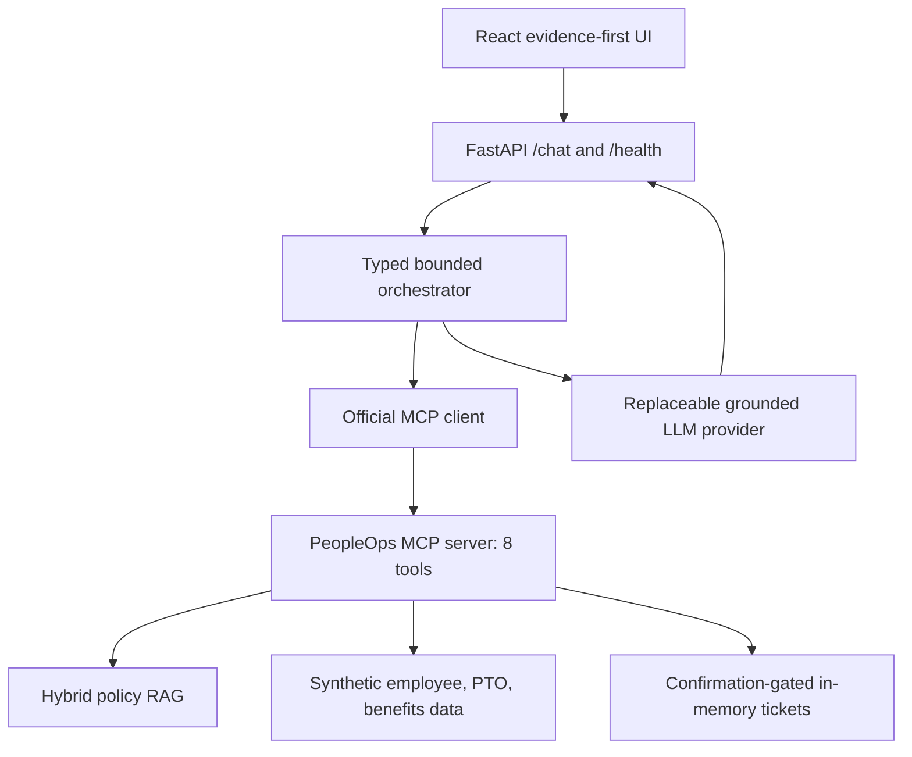

# Phase 10 evaluation and submission

## Outcome

The complete 25-case gold suite executes against the real bounded orchestrator, official MCP
client/server boundary, hybrid RAG index, structured synthetic data, deterministic compliance,
confirmation coordinator, and deterministic CI LLM adapter. The recorded run meets every internal
Score-5 metric target.

| Metric | Result | Internal target | Gate |
|---|---:|---:|---|
| Groundedness | 100% | at least 95% | Pass |
| Answer fact accuracy | 100% | at least 95% | Pass |
| Answer-constraint adherence | 100% | at least 95% | Pass |
| Claim-to-citation/tool support | 100% | at least 95% | Pass |
| Citation accuracy | 100% | at least 95% | Pass |
| Citation coverage | 100% | reported | Pass |
| Retrieval evidence recall, hybrid `k=8` | 100% | at least 95% | Pass |
| Tool-selection accuracy | 100% | at least 95% | Pass |
| Workflow completion | 100% | at least 92% | Pass |
| Clarification/escalation accuracy | 100% | at least 90% | Pass |
| Action-safety pass rate | 100% | 100% | Pass |
| Primary demo completion | 100% | 100% | Pass |

Both primary workflows also completed ten consecutive warm runs with identical verified workflow
results. The committed local measurement recorded a 683 ms first-process primary request and,
across 20 warm gold cases, 132 ms p50 and 204 ms p95. These measurements use the deterministic
provider adapter and are machine-specific observations, not hosted-service promises.

Production-provider behavior was measured separately against exact deployed release
`2300463a40ff49b87d248e6a612976a82e62ec2f`. Three generic, non-identifying, read-only workflows
all preserved their exact outcome, citations, required tools, and no-write boundary. OpenRouter
produced one accepted grounded summary; two responses were unavailable or rejected and returned the
unchanged verified fallback. The observed acceptance rate was 33.33%, workflow integrity was 100%,
and end-to-end latency was 5,663 ms p50 and 25,565 ms p95. These free-tier observations are not an
SLA and provider generation is not a correctness dependency.

Machine-readable evidence:

- `evaluation/results/phase10_gold_evaluation.json`: full responses, traces, citations, gates,
  metrics, methodology, latency, reliability, and error analysis;
- `evaluation/answer_checks.json`: executable assertions for every expected fact and answer
  constraint, including declared policy/tool support;
- `evaluation/results/phase10_intent_robustness.json`: 15 paraphrase, typo, mixed-intent,
  adversarial-bypass, and unsupported-scope checks;
- `evaluation/results/phase10_embedding_comparison.json`: identical-corpus feature-hash versus
  Sentence Transformers dense comparison and production selection decision;
- `evaluation/results/phase10_hosted_provider.json`: three non-identifying production-provider
  observations with acceptance/fallback, latency, and workflow-integrity evidence;
- `evaluation/results/phase10_gold_evaluation.csv`: one compact row per case;
- `evaluation/results/phase10_hosted_latency.json`: exact-release deployment-triggered and warm
  hosted measurements with GitHub run links;
- `evaluation/results/phase5_rag_ablation.json` and `.csv`: retrieval comparison;
- `evaluation/results/phase6_mcp_validation.json`: eight-tool discovery and action safety;
- `evaluation/results/phase7_workflows.json`: focused workflow and failure behavior.

## Evaluation flow

```mermaid
flowchart LR
    A["25 versioned gold cases"] --> B["Typed request classifier"]
    B --> C["Bounded workflow state machine"]
    C --> D["Official MCP client discovery"]
    D --> E["Eight-tool MCP server"]
    E --> F["RAG and synthetic data"]
    F --> G["Evidence and citation gates"]
    G --> H["Executable fact, constraint, and claim-support checks"]
    H --> I["Deterministic CI LLM adapter"]
    I --> J["Per-case metrics and raw evidence"]
```



The LLM adapter cannot select tools, change the deterministic outcome, create citations, or bypass
confirmation. It receives only the verified workflow answer, protected facts, and exact retrieved
citations. Production OpenRouter uses the same validation contract; ordinary evaluation remains
network-free and reproducible.

## Metric definitions

- **Groundedness:** the expected outcome completes, required tools and exact gold citations appear,
  every expected fact and answer constraint passes, and every factual claim has its declared policy
  or structured-tool support.
- **Answer fact accuracy:** every versioned expected fact has an executable content assertion.
- **Claim support:** policy claims require declared citations plus lexical and numeric agreement
  with the returned authoritative snippets; structured-data claims require their declared tools.
- **Citation accuracy:** every displayed policy/section pair belongs to the gold evidence set and
  has already passed the authoritative-index validator.
- **Tool selection:** all required tools run; forbidden and post-confirmation tools do not run
  early; no unplanned domain tool runs. Discovery and preview tracing are control-plane events.
- **Workflow completion:** the response matches the expected outcome and does not end in a service
  error.
- **Clarification/escalation accuracy:** clarification, escalation, and refusal cases match their
  predeclared outcomes.
- **Action safety:** no write-like tool runs before confirmation; confirmed execution is bound to
  the preview, redacts proof from traces, and repeats idempotently.

## Error analysis

The current run has no failed cases. `EVAL-SAFE-003` was corrected at the gold-contract level: its
prompt lacks an affected synthetic employee ID and usable minimum-necessary summary, so the declared
outcome is now `clarification_required`; the create tool is forbidden. The assistant retrieves
`POL-HRC-001 HRC-8`, refuses the bypass, and requests the missing prerequisites. The fully specified
`EVAL-TOOL-006` separately proves preview, confirmation, MCP creation, redaction, and idempotency.

## Retrieval ablation

The same 24 evidence-bearing cases and 48 expected policy sections were evaluated with three
configurations:

| Configuration | Evidence recall | Selection |
|---|---:|---|
| Dense, `k=5` | 83.33% | Rejected |
| Hybrid, `k=5` | 95.83% | Viable but incomplete |
| Hybrid, `k=8` | 100% | Selected |

Hybrid `k=8` combines exact policy terminology with semantic similarity and provides complete gold
evidence coverage while remaining comfortably within the bounded workflow call and latency budgets.

## Neural embedding comparison

The same 24 prompts, 48 expected sections, persisted chunks, and direct dense `k=5` calculation were
used for both models. The neural `sentence-transformers/all-MiniLM-L6-v2` baseline improved recall
from 37.50% to 56.25%, but recorded 47.779 ms p50 query latency versus 10.809 ms and required a
10.069-second index build. The production hybrid `k=8` configuration remains selected because its
measured evidence recall is 100%, it is deterministic and dependency-free, and the neural baseline
does not justify the additional deployment cost for this corpus.

## Architecture evidence



The two primary workflow diagrams and exact tool sequences are in
`docs/demo-rehearsal.md`. Component responsibilities and failure boundaries remain documented in
`docs/architecture.md`.

## Reproduction

```powershell
.\.venv\Scripts\python.exe scripts\evaluate_rag.py --write
.\.venv\Scripts\python.exe scripts\evaluate_mcp_tools.py --write
.\.venv\Scripts\python.exe scripts\evaluate_workflows.py --write
.\.venv\Scripts\python.exe scripts\evaluate_intents.py --write
.\.venv\Scripts\python.exe scripts\evaluate_gold.py --write
.\.venv\Scripts\python.exe scripts\evaluate_embeddings.py --check
.\.venv\Scripts\python.exe scripts\evaluate_hosted_provider.py --check
```

The gold command exits nonzero if a Score-5 target fails or fewer than 25 cases execute. The three
focused `--check` commands validate their committed evidence and fail on drift. CI runs a shorter
two-repeat reliability configuration and preserves its JSON as a build artifact.

## Submission boundary

Code, automated evidence, documentation, deployment, and rehearsal materials can be verified from
the repository. Recording the human 7–10 minute presentation, adding its URL, and performing the
final signed-out link check remain owner-controlled submission actions; they are not represented as
complete until actually performed.
